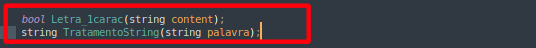

# Compactando arquivos texto para binário com o código de Huffman

  
</a> 

<h2><a>Objetivo</a></h2>

Criar  uma árvore binária que utiliza o código de Huffman para comprimir arquivos para isso:

<ol>
  <li>Contabilizar a recorrência de cada palavre RP(Recorrência da palavra) no arquivo.</li>
  <li>Normalizar a contabilização entre 0 e 1 utilizando a formula -> RP / (max(RP) - min(RP)).</li>
  <li>Montar a árvore com as regras apresentadas por Huffman.</li>
  <li>Troque as palavras pela codificação binária (utlizando booleano para representar 0 e 1).</li>
  <li>Salve o arquivo em formato binário e observe qual foi o ganho de espaço obtido.</li>
</ol>

<h2><a>Explicando o código</a></h2>

<h4><a>huffman.hpp</a></h4>

Para armazenarmos os dados da nossa árvore e do código de Huffman trabalhamos com duas estruturas uma chamada DADOS onde possui variáveis do tipo string chamanda palavra que armazena as palavras do texto, um float que armazena a normalização de cada palavra e uma string código que armazena o código de huffman.

Já na nossa estrutura árvore contamos com nossa estrutura DADOS e mais variáveis do tipo árvore que são seus respectivos filhos direito e esquedo como também o seu pai.

Declaração duas funções uma que utilizamos para juntar os nos e outra que é um InsertionSort na qual vou explicar mais para frente.

<h4><a>huffman.cpp</a></h4>

<strong>InsertionShort</strong> -> Na nossa função InsertionShort recebemos o nosso vector do tipo árvore, o intuito dessa função é ordenar o nosso vetor deixando as palavras que tiveram maior recorrência no começo do vetor e as menores no final.

<strong>Juntanos</strong> -> Na função Juntanos recebemos nosso vector do tipo árvore declarado na main, o objetivo dessa função é juntar nosso nos da árvore em apenas uma única posição no vetor.

<h4><a>fila.hpp</a></h4>

Aqui declaramos um simples fila que usaremos para estruturar nossos dados

Declaração das funções printlargua, geracod, buscapalavracod, jog

<h4><a>fila.cpp</a></h4>

Implementação da Fila simples no arquivo cpp.

<strong>PrintLargura</strong> -> Printa nossa árvore em largura facilitanto assim nossa compreesão.

<strong>GeraCod</strong> -> Gera um código para cada nó/palavra do texto.

<strong>JogarCodVetor</strong> -> Joga código da palavra em cada posição no vetor.

<strong>BuscaPalavraCod</strong> -> Nossa função BuscaPalavraCod é a função que vai ter a palavra do texto e vai retornar o seu respectivo código.

<strong>Letra_1carac</strong> -> Lê meu texto e retira todas palavra que possui somento um caracter.

<strong>TratamentoString</strong> -> Trata nosso texto retirando todos os caracteres especiais.

<h4><a>main.cpp</a></h4>

Na nossa main criação uma hash com a função unordered_map onde seu primeiro dado é uma string e o seu segundo um float que armazenam as palavra e suas normalizações.

Essa parte do código abre o arquivo .txt e lê ele tokenizando com o espaço em cada palavra, por fim filtramos o texto retirando palavras de 1 caracter e caracteres especiais.

Na função seguinte armazenamos nosso vector com as plavras do arquivo txt na hash.

Para facilitar o cálculo de normalização procuramos a palavra com mais recorrência no texto e a palavra com menos recorrência.

<h2><a>Funcionamento</a></h2>

Aqui temos a impressão da árvore criada.

Aqui o temanho do arquivo texto.

Aqui temos o arquivo binário compactado gerado reduzindo em 25x o tamanho arquivo texto.

<h2><a>Conclusão</a></h2>

| Comando                |  Função                                                                                           |                     
| -----------------------| ------------------------------------------------------------------------------------------------- |
|  `make clean`          | Apaga a última compilação realizada contida na pasta build                                        |
|  `make`                | Executa a compilação do programa utilizando o g++, e o resultado vai para a pasta build           |
|  `make run`            | Executa o programa da pasta build após a realização da compilação                                 |

<h2><a>Dados</a></h2>

Disciplina: Algoritmos e Estrutura De Dados II 2022-2

Aluno: Caio Fernando Dias

Professor: Michel Pires

Data: 22/09/2022

<h2><a>Contato</a></h2>

 
  
  
  
  
  
  

