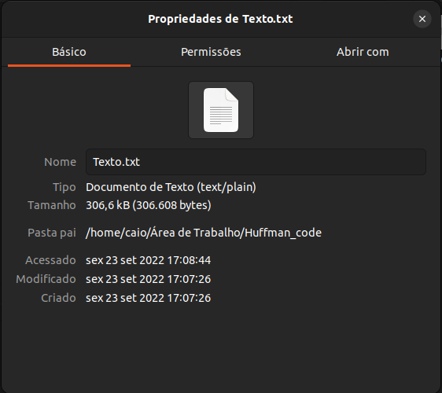

# Compactando arquivos .txt para .bin com o código de Huffman

  
</a> 

<h2><a>Objetivo</a></h2>

<h2><a>Pseudo código<a><h2>

<h2><a>Explicando o código</a></h2>

<h4><a>huffman.hpp</a></h4>

<h4><a>huffman.cpp</a></h4>

<h4><a>fila.hpp</a></h4>

<h4><a>fila.cpp</a></h4>

<h4><a>main.cpp</a></h4>

<h2><a>Funcionamento</a></h2>

<h2><a>Conclusão</a></h2>

| Comando                |  Função                                                                                           |                     
| -----------------------| ------------------------------------------------------------------------------------------------- |
|  `make clean`          | Apaga a última compilação realizada contida na pasta build                                        |
|  `make`                | Executa a compilação do programa utilizando o g++, e o resultado vai para a pasta build           |
|  `make run`            | Executa o programa da pasta build após a realização da compilação                                 |

<h2><a>Dados</a></h2>

Disciplina: Algoritmos e Estrutura De Dados II 2022-2

Aluno: Caio Fernando Dias

Professor: Michel Pires

Data: 22/09/2022

<h2><a>Contato</a></h2>

 
  
  
  
  
  
  

